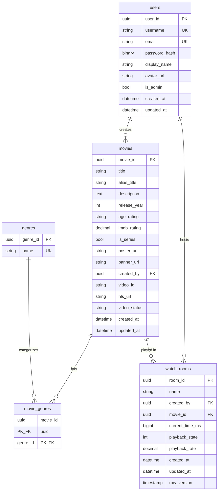
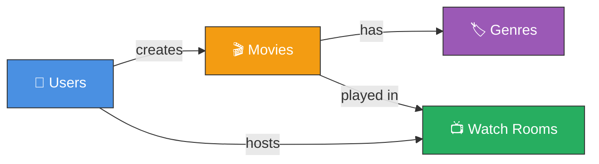
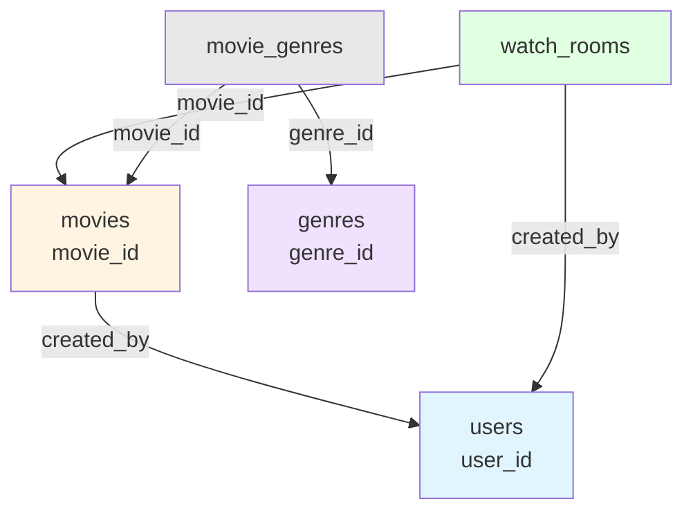
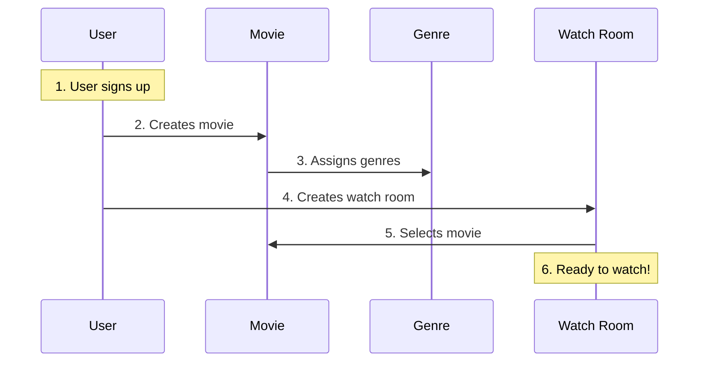

# 🗄️ NicePhim Database - Simple ERD

## 📊 Entity Relationship Diagram

---

## 🎯 Simple Relationships

---

## 📋 Tables Summary

| # | Table | Records | Description |
|---|-------|---------|-------------|
| 1 | **users** | User accounts | Authentication & profiles |
| 2 | **movies** | Video library | Movies with metadata |
| 3 | **genres** | Categories | Action, Drama, Comedy, etc |
| 4 | **movie_genres** | Links | Many-to-many junction |
| 5 | **watch_rooms** | Rooms | Watch together rooms |

**Total: 5 tables** (6 including system table)

---

## 🔗 Foreign Keys

**5 Foreign Keys:**
1. movies.created_by → users.user_id
2. watch_rooms.created_by → users.user_id
3. watch_rooms.movie_id → movies.movie_id
4. movie_genres.movie_id → movies.movie_id (CASCADE)
5. movie_genres.genre_id → genres.genre_id (CASCADE)

---

## 💡 Key Points

### **users**
- Stores login credentials (bcrypt hashed)
- Username & email are unique
- Can create movies and watch rooms

### **movies**
- Video metadata (title, description, poster, etc)
- Links to HLS video file (.m3u8)
- Can have multiple genres

### **genres**
- Simple category names (Action, Drama, etc)
- Reusable across movies

### **movie_genres**
- Junction table (no extra data)
- Connects movies ↔ genres (many-to-many)

### **watch_rooms**
- Watch together session
- Tracks current playback position & state
- Host controls room

---

## 📊 Data Flow

---

**Schema Version:** V7 (2025-10-22)  
**Tables:** 5 active + 1 system  
**Database:** nicephim (SQL Server 2022)
