# 🗄️ NicePhim Database Schema - Entity Relationship Diagram

## 📊 ERD Overview (After V7 Cleanup)


---

## 🔗 Detailed Entity Descriptions

### 1️⃣ **users** - User Authentication & Profiles

**Purpose:** Store user accounts for authentication and profile management

| Column | Type | Constraints | Description |
|--------|------|-------------|-------------|
| `user_id` | UNIQUEIDENTIFIER | PRIMARY KEY | Unique user identifier |
| `username` | NVARCHAR(100) | UNIQUE, NOT NULL | Login username |
| `email` | NVARCHAR(255) | UNIQUE, NOT NULL | Email address |
| `password_hash` | VARBINARY(256) | NOT NULL | Hashed password (bcrypt) |
| `display_name` | NVARCHAR(120) | NULL | Display name for UI |
| `avatar_url` | NVARCHAR(500) | NULL | Profile picture URL |
| `is_admin` | BIT | DEFAULT 0 | Admin flag |
| `created_at` | DATETIME2(3) | DEFAULT SYSUTCDATETIME() | Account creation time |
| `updated_at` | DATETIME2(3) | NULL | Last update time |

**Relationships:**
- 1 user can create many movies (1:N)
- 1 user can create many watch rooms (1:N)

**Indexes:**
- `PK_users` on `user_id` (clustered)
- `UQ_username` on `username` (unique)
- `UQ_email` on `email` (unique)

---

### 2️⃣ **movies** - Video Library

**Purpose:** Store movie/video metadata and file references

| Column | Type | Constraints | Description |
|--------|------|-------------|-------------|
| `movie_id` | UNIQUEIDENTIFIER | PRIMARY KEY | Unique movie identifier |
| `title` | NVARCHAR(255) | NOT NULL | Movie title |
| `alias_title` | NVARCHAR(255) | NULL | Alternative title (slug) |
| `description` | NVARCHAR(MAX) | NULL | Movie description |
| `release_year` | SMALLINT | NULL | Release year |
| `age_rating` | NVARCHAR(10) | NULL | Age rating (G, PG, PG-13, R, etc) |
| `imdb_rating` | DECIMAL(3,1) | NULL | IMDB rating (0.0-10.0) |
| `is_series` | BIT | DEFAULT 0 | Series flag (currently unused) |
| `poster_url` | NVARCHAR(500) | NULL | Poster image URL |
| `banner_url` | NVARCHAR(500) | NULL | Banner image URL |
| `created_by` | UNIQUEIDENTIFIER | FK → users.user_id, NOT NULL | Creator user ID |
| `video_id` | NVARCHAR(255) | NULL | Video file identifier |
| `hls_url` | NVARCHAR(1000) | NULL | HLS manifest URL (.m3u8) |
| `video_status` | NVARCHAR(20) | NULL | Encoding status (pending, processing, completed, failed) |
| `created_at` | DATETIME2(3) | DEFAULT SYSUTCDATETIME() | Creation time |
| `updated_at` | DATETIME2(3) | NULL | Last update time |

**Relationships:**
- Many movies belong to 1 user (N:1)
- 1 movie can have many genres (1:N through movie_genres)
- 1 movie can be watched in many rooms (1:N)

**Foreign Keys:**
- `FK_movies_user` → `users(user_id)`

**Indexes:**
- `PK_movies` on `movie_id` (clustered)

---

### 3️⃣ **genres** - Movie Categories

**Purpose:** Store genre categories for movie classification

| Column | Type | Constraints | Description |
|--------|------|-------------|-------------|
| `genre_id` | UNIQUEIDENTIFIER | PRIMARY KEY | Unique genre identifier |
| `name` | NVARCHAR(80) | UNIQUE, NOT NULL | Genre name (Action, Drama, Comedy, etc) |

**Relationships:**
- 1 genre can be assigned to many movies (1:N through movie_genres)

**Indexes:**
- `PK_genres` on `genre_id` (clustered)
- `UQ_genre_name` on `name` (unique)

---

### 4️⃣ **movie_genres** - Many-to-Many Junction Table

**Purpose:** Link movies with their genres (many-to-many relationship)

| Column | Type | Constraints | Description |
|--------|------|-------------|-------------|
| `movie_id` | UNIQUEIDENTIFIER | PK, FK → movies.movie_id | Movie reference |
| `genre_id` | UNIQUEIDENTIFIER | PK, FK → genres.genre_id | Genre reference |

**Relationships:**
- Junction table connecting movies ↔ genres

**Foreign Keys:**
- `FK_mg_movie` → `movies(movie_id)` ON DELETE CASCADE
- `FK_mg_genre` → `genres(genre_id)` ON DELETE CASCADE

**Indexes:**
- `PK_movie_genres` on `(movie_id, genre_id)` (composite primary key)

---

### 5️⃣ **watch_rooms** - Watch Together Rooms

**Purpose:** Store watch together room state and configuration

| Column | Type | Constraints | Description |
|--------|------|-------------|-------------|
| `room_id` | UNIQUEIDENTIFIER | PRIMARY KEY | Unique room identifier |
| `name` | NVARCHAR(200) | NOT NULL | Room name |
| `created_by` | UNIQUEIDENTIFIER | FK → users.user_id, NOT NULL | Room creator (host) |
| `movie_id` | UNIQUEIDENTIFIER | FK → movies.movie_id, NULL | Current movie playing |
| `current_time_ms` | BIGINT | DEFAULT 0 | Current playback position (ms) |
| `playback_state` | TINYINT | DEFAULT 0 | Playback state (0=paused, 1=playing) |
| `playback_rate` | DECIMAL(3,2) | DEFAULT 1.0 | Playback speed (0.5x, 1x, 1.5x, 2x) |
| `created_at` | DATETIME2(3) | DEFAULT SYSUTCDATETIME() | Room creation time |
| `updated_at` | DATETIME2(3) | NULL | Last update time |
| `row_version` | TIMESTAMP | AUTO | Optimistic concurrency token |

**Relationships:**
- Many rooms belong to 1 user (creator) (N:1)
- Many rooms can watch 1 movie (N:1)

**Foreign Keys:**
- `FK_wr_owner` → `users(user_id)`
- `FK_wr_movie` → `movies(movie_id)`

**Indexes:**
- `PK_watch_rooms` on `room_id` (clustered)

**Notes:**
- Room members tracked in-memory (not persisted)
- Chat messages real-time only via WebSocket
- Manual sync only (no auto play/pause/seek sync)

---

## 🔗 Relationship Summary


---

## 📋 Foreign Key Constraints

| Constraint Name | From Table | From Column | To Table | To Column | On Delete |
|----------------|------------|-------------|----------|-----------|-----------|
| `FK_movies_user` | movies | created_by | users | user_id | NO ACTION |
| `FK_mg_movie` | movie_genres | movie_id | movies | movie_id | CASCADE |
| `FK_mg_genre` | movie_genres | genre_id | genres | genre_id | CASCADE |
| `FK_wr_owner` | watch_rooms | created_by | users | user_id | NO ACTION |
| `FK_wr_movie` | watch_rooms | movie_id | movies | movie_id | NO ACTION |

---

## 📊 Table Statistics

| Table | Primary Key | Foreign Keys | Unique Constraints | Indexes | Purpose |
|-------|-------------|--------------|-------------------|---------|---------|
| **users** | 1 | 0 | 2 (username, email) | 3 | Authentication |
| **movies** | 1 | 1 (created_by) | 0 | 1 | Video Library |
| **genres** | 1 | 0 | 1 (name) | 2 | Categories |
| **movie_genres** | 1 (composite) | 2 (movie_id, genre_id) | 0 | 1 | M:N Junction |
| **watch_rooms** | 1 | 2 (created_by, movie_id) | 0 | 1 | Watch Together |

**Total:** 5 active tables (6 including system table `flyway_schema_history`)

---

## 🎯 Cardinality Diagram


**Legend:**
- `||--o{` = One-to-Many (1:N)
- `||--||` = One-to-One (1:1)
- `}o--o{` = Many-to-Many (M:N)

---

## 🗂️ Data Flow Example

### **Creating a Watch Room:**


### **Assigning Genres to Movie:**


---

## 🔍 Query Examples

### **Get all movies with genres:**

```sql
SELECT 
    m.title,
    m.release_year,
    m.imdb_rating,
    STRING_AGG(g.name, ', ') AS genres
FROM dbo.movies m
LEFT JOIN dbo.movie_genres mg ON m.movie_id = mg.movie_id
LEFT JOIN dbo.genres g ON mg.genre_id = g.genre_id
GROUP BY m.movie_id, m.title, m.release_year, m.imdb_rating
ORDER BY m.created_at DESC;
```

### **Get user's watch rooms:**

```sql
SELECT 
    wr.room_id,
    wr.name,
    m.title AS movie_title,
    wr.current_time_ms,
    wr.playback_state,
    u.username AS creator
FROM dbo.watch_rooms wr
INNER JOIN dbo.users u ON wr.created_by = u.user_id
LEFT JOIN dbo.movies m ON wr.movie_id = m.movie_id
WHERE u.username = 'john_doe'
ORDER BY wr.created_at DESC;
```

### **Get movies by genre:**

```sql
SELECT 
    m.title,
    m.release_year,
    g.name AS genre
FROM dbo.movies m
INNER JOIN dbo.movie_genres mg ON m.movie_id = mg.movie_id
INNER JOIN dbo.genres g ON mg.genre_id = g.genre_id
WHERE g.name = 'Action'
ORDER BY m.release_year DESC;
```

---

## 📝 Schema Version History

| Version | Date | Tables Count | Description |
|---------|------|--------------|-------------|
| V1 | 2025-09-20 | 15 | Initial schema with future features |
| V2 | 2025-09-20 | 15 | Added video fields to movies |
| V3 | 2025-09-26 | 15 | Added broadcast fields to watch_rooms |
| V4 | 2025-10-21 | 15 | Removed broadcast fields |
| V5 | 2025-10-21 | 15 | Removed is_private field |
| V6 | 2025-10-22 | 15 | Removed invite_code field |
| **V7** | **2025-10-22** | **6** | **Removed 10 unused tables** ✅ |

---

## 🎨 Simplified Entity View

```mermaid
graph TD
    U[👤 users<br/>Authentication & Profiles]
    M[🎬 movies<br/>Video Library]
    G[🏷️ genres<br/>Categories]
    MG[🔗 movie_genres<br/>M:N Junction]
    WR[📺 watch_rooms<br/>Watch Together]
    
    U -->|creates| M
    U -->|hosts| WR
    M -->|belongs to| MG
    G -->|categorizes| MG
    M -->|watched in| WR
    
    style U fill:#4a90e2,color:#fff
    style M fill:#f39c12,color:#fff
    style G fill:#9b59b6,color:#fff
    style MG fill:#95a5a6,color:#fff
    style WR fill:#27ae60,color:#fff
```



---

## 🔐 Security Notes

### **users table:**
- `password_hash` stored as VARBINARY(256) using bcrypt
- Never expose password hashes in API responses
- Username and email must be unique

### **Access Control:**
- `movies.created_by` → User who uploaded the movie
- `watch_rooms.created_by` → Room host (controls room)
- `users.is_admin` → Admin privileges

---

## 💾 Storage Considerations

### **NVARCHAR vs VARCHAR:**
- All text fields use NVARCHAR for Unicode support (Vietnamese, emoji, etc)

### **UNIQUEIDENTIFIER:**
- All primary keys use GUID for distributed systems
- Generated via `NEWID()` or application code

### **DATETIME2(3):**
- Millisecond precision for timestamps
- Uses `SYSUTCDATETIME()` for UTC timestamps

### **ROWVERSION:**
- `watch_rooms.row_version` for optimistic concurrency control
- Auto-increments on every UPDATE

---

## 📌 Notes

### **Removed Features (V7):**
- ❌ Episodes support (series/multi-episode)
- ❌ Video renditions storage (HLS generated dynamically)
- ❌ Comments system
- ❌ User favorites
- ❌ Watch room persistence (members, messages, events)

### **Current Features:**
- ✅ User authentication & profiles
- ✅ Movie library with metadata
- ✅ Genre categorization
- ✅ Watch together rooms
- ✅ Real-time chat (WebSocket, not persisted)
- ✅ Manual video sync

---

**Database:** nicephim  
**DBMS:** Microsoft SQL Server 2022  
**Schema Version:** V7  
**Generated:** 2025-10-22  
**Application:** NicePhim Video Streaming Platform

---

## 🖼️ Full ERD with All Details

```mermaid
erDiagram
    users {
        UNIQUEIDENTIFIER user_id PK "DEFAULT NEWID()"
        NVARCHAR_100 username UK "NOT NULL"
        NVARCHAR_255 email UK "NOT NULL"
        VARBINARY_256 password_hash "NOT NULL, bcrypt"
        NVARCHAR_120 display_name "NULL"
        NVARCHAR_500 avatar_url "NULL"
        BIT is_admin "DEFAULT 0"
        DATETIME2 created_at "DEFAULT SYSUTCDATETIME()"
        DATETIME2 updated_at "NULL"
    }
    
    movies {
        UNIQUEIDENTIFIER movie_id PK "DEFAULT NEWID()"
        NVARCHAR_255 title "NOT NULL"
        NVARCHAR_255 alias_title "NULL, slug"
        NVARCHAR_MAX description "NULL"
        SMALLINT release_year "NULL"
        NVARCHAR_10 age_rating "NULL, G/PG/PG-13/R"
        DECIMAL_3_1 imdb_rating "NULL, 0.0-10.0"
        BIT is_series "DEFAULT 0, unused"
        NVARCHAR_500 poster_url "NULL"
        NVARCHAR_500 banner_url "NULL"
        UNIQUEIDENTIFIER created_by FK "NOT NULL"
        NVARCHAR_255 video_id "NULL"
        NVARCHAR_1000 hls_url "NULL, .m3u8"
        NVARCHAR_20 video_status "NULL, pending/processing/completed/failed"
        DATETIME2 created_at "DEFAULT SYSUTCDATETIME()"
        DATETIME2 updated_at "NULL"
    }
    
    genres {
        UNIQUEIDENTIFIER genre_id PK "DEFAULT NEWID()"
        NVARCHAR_80 name UK "NOT NULL"
    }
    
    movie_genres {
        UNIQUEIDENTIFIER movie_id PK_FK "CASCADE DELETE"
        UNIQUEIDENTIFIER genre_id PK_FK "CASCADE DELETE"
    }
    
    watch_rooms {
        UNIQUEIDENTIFIER room_id PK "DEFAULT NEWID()"
        NVARCHAR_200 name "NOT NULL"
        UNIQUEIDENTIFIER created_by FK "NOT NULL, host"
        UNIQUEIDENTIFIER movie_id FK "NULL"
        BIGINT current_time_ms "DEFAULT 0, milliseconds"
        TINYINT playback_state "DEFAULT 0, 0=paused/1=playing"
        DECIMAL_3_2 playback_rate "DEFAULT 1.0, 0.5x-2.0x"
        DATETIME2 created_at "DEFAULT SYSUTCDATETIME()"
        DATETIME2 updated_at "NULL"
        TIMESTAMP row_version "AUTO, optimistic lock"
    }
    
    users ||--o{ movies : "FK_movies_user: created_by"
    users ||--o{ watch_rooms : "FK_wr_owner: created_by"
    movies ||--o{ movie_genres : "FK_mg_movie: movie_id CASCADE"
    genres ||--o{ movie_genres : "FK_mg_genre: genre_id CASCADE"
    movies ||--o{ watch_rooms : "FK_wr_movie: movie_id"
```

---

**End of Database Schema Documentation** 🎉
