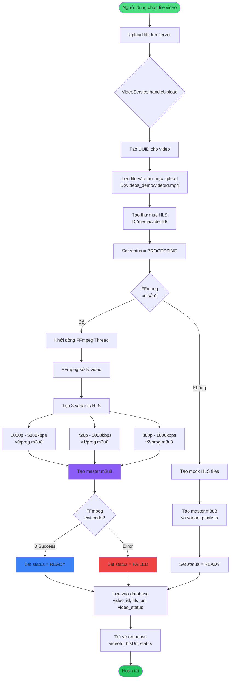
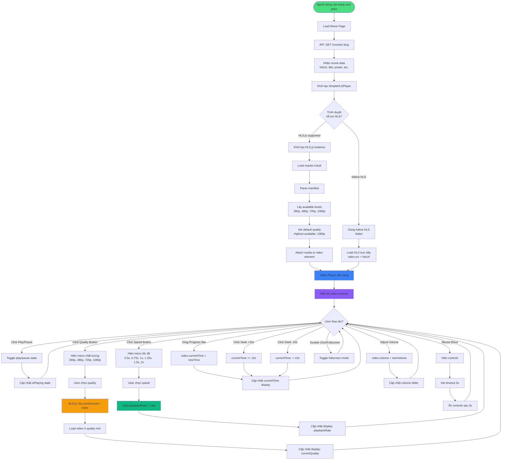
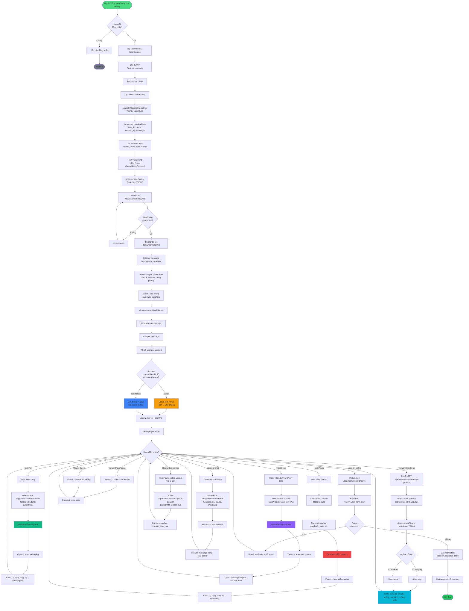

# NicePhim - System Workflow Diagrams

## 1. Video Upload Workflow

## 2. Video Loading & Playback Workflow

## 3. Watch Together (Xem Chung) Workflow

## Giải thích chi tiết

### 1. Video Upload
- User upload file video qua frontend
- Backend tạo UUID cho video và lưu file gốc
- FFmpeg xử lý video thành 3 variants HLS (360p, 720p, 1080p)
- Tạo master.m3u8 playlist cho adaptive streaming
- Lưu metadata vào database (video_id, hls_url, video_status)

### 2. Video Loading & Playback
- Frontend load movie data từ API
- Khởi tạo HLS.js player với adaptive streaming
- User có thể chọn chất lượng video (360p - 1080p)
- User có thể điều chỉnh tốc độ phát (0.5x - 2x)
- Controls tự động ẩn/hiện sau 3 giây

### 3. Watch Together
- Host tạo phòng với roomId và inviteCode
- WebSocket kết nối cho real-time communication
- Host điều khiển video → broadcast đến viewers
- Viewers tự động sync theo host (play/pause/seek)
- Viewers có thể dùng sync button để đồng bộ thủ công
- Chat system cho giao tiếp trong phòng
- Host position được cập nhật mỗi 2 giây
