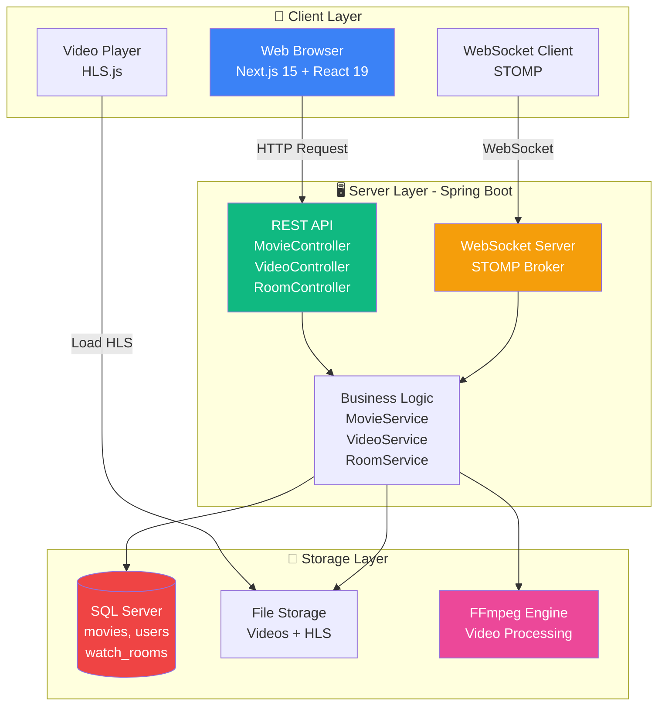
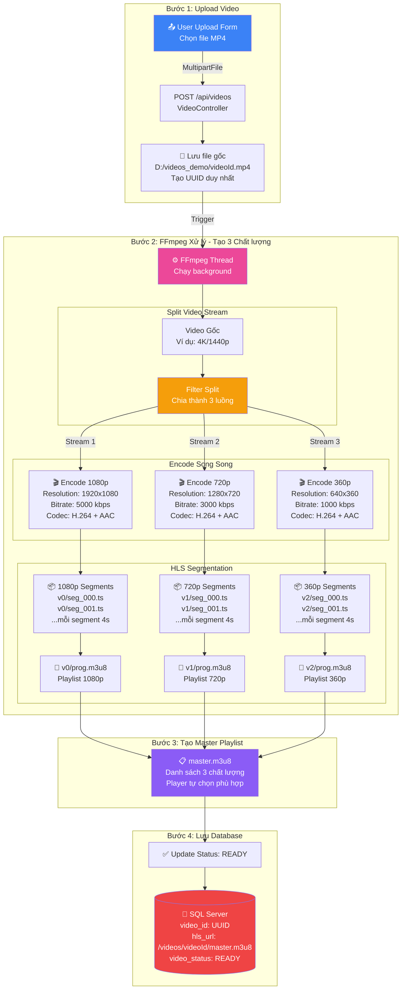
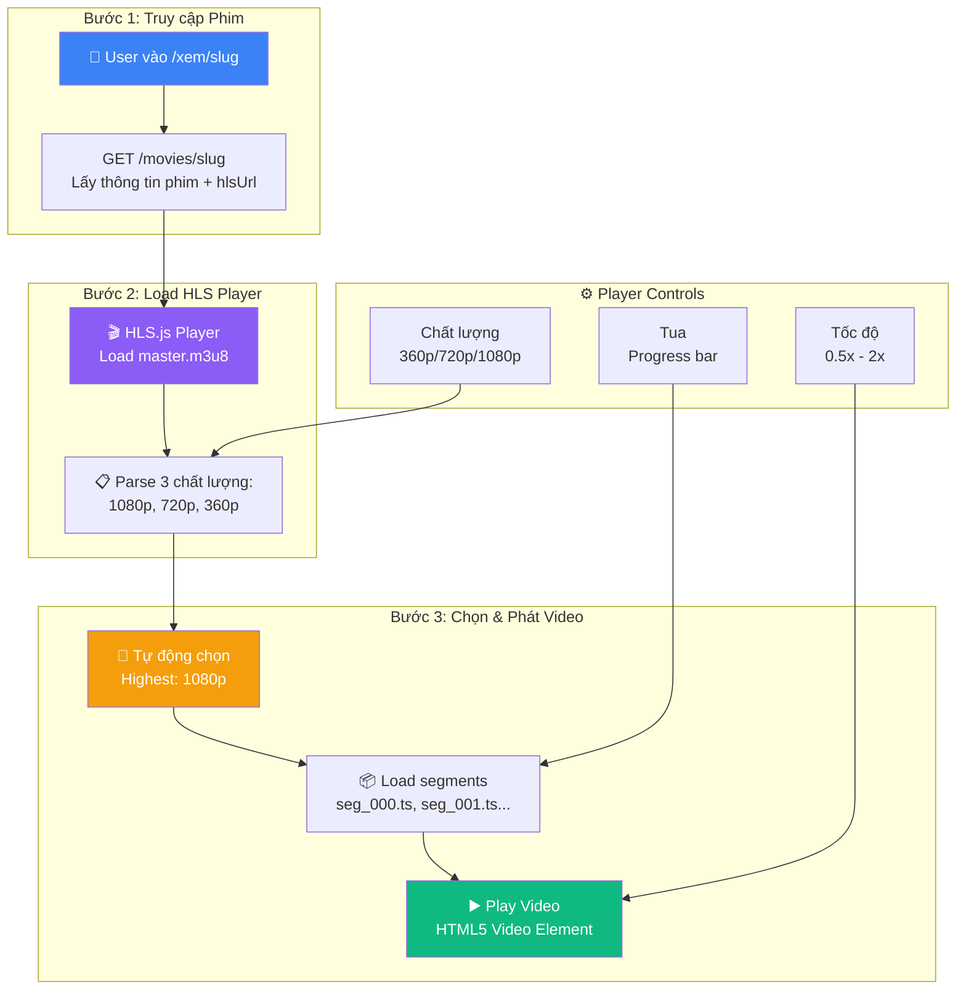
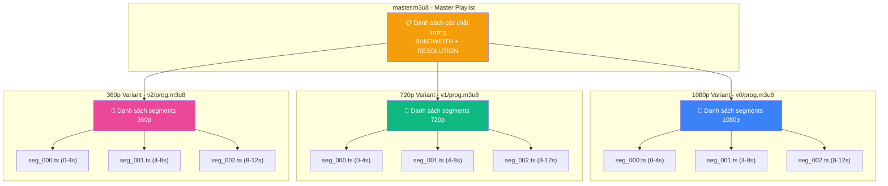
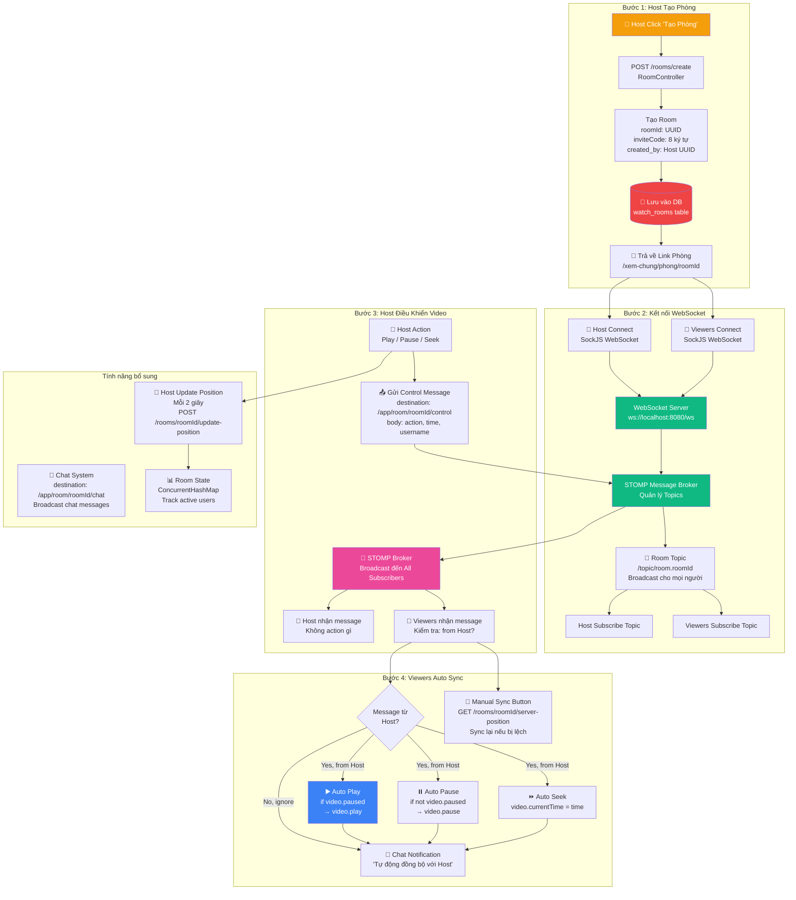
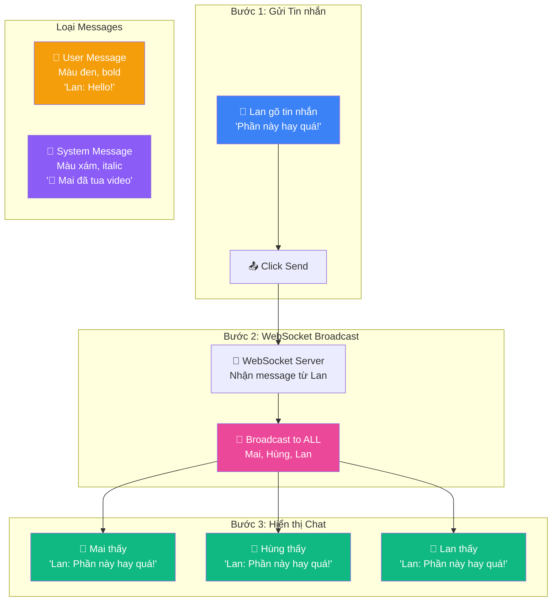
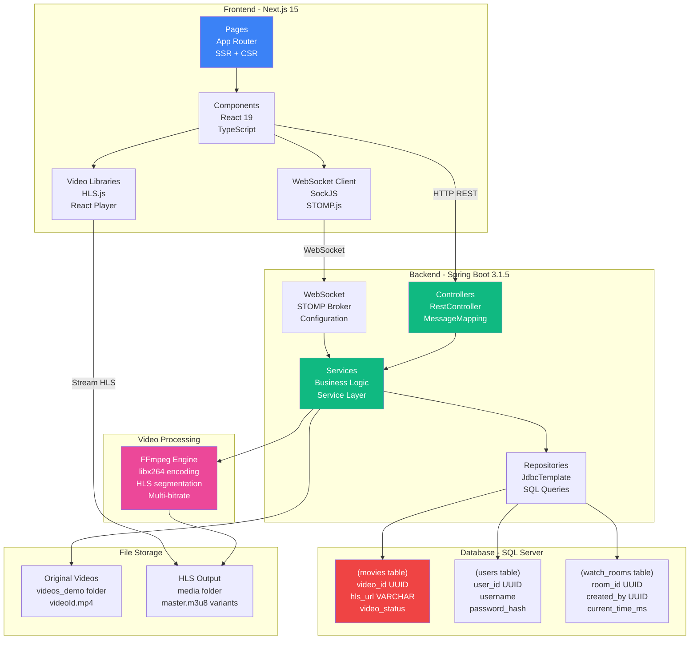

# NicePhim - Architecture Diagrams (Đơn giản)

## 1. Tổng quan Kiến trúc Hệ thống



**Chi tiết kỹ thuật:**
- **Client**: Next.js App Router với React Server Components
- **API**: RESTful endpoints + WebSocket cho real-time
- **Database**: SQL Server với UUID primary keys
- **Video**: FFmpeg HLS transcoding + HLS.js adaptive streaming

## 2. Luồng Upload & Xử lý Video



**Chi tiết kỹ thuật:**

### 🎬 Quá trình Encode (Mã hóa)
```
Video Gốc (ví dụ: 4K @ 20000 kbps)
           ↓
    FFmpeg Filter Split
           ↓
    ┌──────┴──────┬──────────┐
    ↓             ↓          ↓
1080p         720p        360p
Scale         Scale       Scale
1920x1080     1280x720    640x360
    ↓             ↓          ↓
Encode        Encode      Encode
5000 kbps     3000 kbps   1000 kbps
H.264+AAC     H.264+AAC   H.264+AAC
```

### 📦 HLS Segmentation (Chia nhỏ)
```
Mỗi variant được chia thành segments 4 giây:

1080p/v0/:
  ├─ seg_000.ts (0-4s)
  ├─ seg_001.ts (4-8s)
  ├─ seg_002.ts (8-12s)
  └─ prog.m3u8 (playlist)

720p/v1/:
  ├─ seg_000.ts (0-4s)
  ├─ seg_001.ts (4-8s)
  └─ prog.m3u8

360p/v2/:
  ├─ seg_000.ts (0-4s)
  ├─ seg_001.ts (4-8s)
  └─ prog.m3u8
```

### 📋 Master Playlist
```m3u8
#EXTM3U
#EXT-X-STREAM-INF:BANDWIDTH=5000000,RESOLUTION=1920x1080
v0/prog.m3u8
#EXT-X-STREAM-INF:BANDWIDTH=3000000,RESOLUTION=1280x720
v1/prog.m3u8
#EXT-X-STREAM-INF:BANDWIDTH=1000000,RESOLUTION=640x360
v2/prog.m3u8
```

**Lợi ích:**
- ✅ Người dùng mạng chậm xem 360p mượt
- ✅ Người dùng mạng tốt xem 1080p HD
- ✅ HLS.js tự động chuyển đổi chất lượng khi mạng thay đổi

## 3. Luồng Phát Video với HLS



**Giải thích đơn giản:**

### 🎬 HLS Streaming hoạt động như thế nào?

**Bước 1: User truy cập phim**
```
User vào: nicephim.com/xem/spider-man
    ↓
Frontend call API: GET /movies/spider-man
    ↓
Nhận hlsUrl: /videos/abc123/master.m3u8
```

**Bước 2: HLS.js Player load master.m3u8**
```
master.m3u8 chứa:
├─ 1080p → /videos/abc123/v0/prog.m3u8
├─ 720p  → /videos/abc123/v1/prog.m3u8
└─ 360p  → /videos/abc123/v2/prog.m3u8

Player parse → Có 3 chất lượng
```

**Bước 3: Tự động chọn chất lượng cao nhất**
```
Player chọn 1080p (mặc định)
    ↓
Load v0/prog.m3u8 → Danh sách segments:
    - seg_000.ts (0-4s)
    - seg_001.ts (4-8s)
    - seg_002.ts (8-12s)
    - ...
    ↓
Load từng segment và play
```

**Player Controls:**
- 🎯 **Chất lượng:** User click 720p → Player chuyển sang load v1/prog.m3u8
- ⚡ **Tốc độ:** User chọn 1.5x → `video.playbackRate = 1.5`
- ⏩ **Tua:** User tua đến 5:00 → Load segments từ 5:00 trở đi

**Code ví dụ:**
```javascript
// Initialize HLS.js
const hls = new Hls();
hls.loadSource('/videos/abc123/master.m3u8');  // Load master playlist
hls.attachMedia(video);                         // Attach to video element

// Chuyển chất lượng
hls.currentLevel = 1;  // 0=1080p, 1=720p, 2=360p

// Controls
video.play();                    // Play
video.currentTime = 300;         // Tua đến 5:00
video.playbackRate = 1.5;        // Tốc độ 1.5x
```

---

### 📺 Cách HLS (HTTP Live Streaming) hoạt động

#### 1. HLS là gì?

**HLS = HTTP Live Streaming**
- Phát video qua giao thức HTTP (như load trang web)
- Chia video thành nhiều file nhỏ (segments)
- Hỗ trợ nhiều chất lượng (adaptive bitrate)
- Tự động chuyển chất lượng theo tốc độ mạng

**So sánh:**

| Streaming thông thường | HLS Streaming |
|------------------------|---------------|
| 1 file video lớn (2GB) | Nhiều segments nhỏ (4s/segment) |
| Tải cả video mới xem được | Tải segment đầu tiên → Xem ngay |
| 1 chất lượng cố định | Nhiều chất lượng, tự động chuyển |
| Cần video server đặc biệt | Dùng HTTP server thông thường |

#### 2. Cấu trúc HLS



#### 3. Nội dung các file

**master.m3u8 - Master Playlist:**
```m3u8
#EXTM3U
#EXT-X-VERSION:3

# 1080p - 5 Mbps
#EXT-X-STREAM-INF:BANDWIDTH=5000000,RESOLUTION=1920x1080
v0/prog.m3u8

# 720p - 3 Mbps
#EXT-X-STREAM-INF:BANDWIDTH=3000000,RESOLUTION=1280x720
v1/prog.m3u8

# 360p - 1 Mbps
#EXT-X-STREAM-INF:BANDWIDTH=1000000,RESOLUTION=640x360
v2/prog.m3u8
```

**v0/prog.m3u8 - Variant Playlist (1080p):**
```m3u8
#EXTM3U
#EXT-X-VERSION:3
#EXT-X-TARGETDURATION:4
#EXT-X-MEDIA-SEQUENCE:0

#EXTINF:4.0,
seg_000.ts
#EXTINF:4.0,
seg_001.ts
#EXTINF:4.0,
seg_002.ts
#EXTINF:4.0,
seg_003.ts
...
#EXT-X-ENDLIST
```

**seg_000.ts - Video Segment:**
```
Binary video data (H.264 + AAC)
Duration: 4 seconds
Size: ~2.5 MB (1080p)
```

#### 4. Luồng hoạt động chi tiết

```
┌─────────────────────────────────────────────────────────────┐
│ Timeline: User xem phim Spider-Man (120 phút = 1800 segments) │
└─────────────────────────────────────────────────────────────┘

Giây 0:
  Player → Load master.m3u8
       ← Nhận danh sách: 1080p, 720p, 360p
  
  Player → Đo tốc độ mạng (bandwidth detection)
       ← Kết quả: 10 Mbps → Chọn 1080p (cần 5 Mbps)
  
  Player → Load v0/prog.m3u8
       ← Nhận danh sách 1800 segments

Giây 1:
  Player → Request seg_000.ts (0-4s)
       ← Download 2.5 MB
       → Bắt đầu PLAY ngay khi có segment đầu tiên!

Giây 2:
  Player → Request seg_001.ts (4-8s)  ← Load segment tiếp theo
       ← Download 2.5 MB              ← Trong khi đang play seg_000

Giây 5:
  Player đang play seg_001.ts
       → Request seg_002.ts (8-12s)   ← Luôn buffer trước 1-2 segments

Giây 30:
  Mạng bị chậm! Tốc độ giảm xuống 2 Mbps
  Player phát hiện download seg_007 bị lag
       → Tự động chuyển xuống 720p
       → Request v1/seg_008.ts thay vì v0/seg_008.ts
       → Video không bị giật, chỉ giảm độ phân giải!

Giây 60:
  Mạng tốt lại! Tốc độ lên 15 Mbps
  Player phát hiện buffer đầy, mạng nhanh
       → Tự động chuyển lên 1080p
       → Request v0/seg_015.ts
       → Chất lượng tăng lên mượt mà!

Giây 120:
  User tua đến 1:00:00 (phút 60)
  Player → Bỏ qua segments 0-899
       → Request seg_900.ts (60:00 - 60:04)
       → Play ngay từ 1 giờ!
```

#### 5. Adaptive Bitrate Switching

**Cách Player quyết định chuyển chất lượng:**

```javascript
// Player logic (pseudo-code)
function chooseQuality() {
  const bandwidth = measureBandwidth();        // Đo tốc độ mạng
  const bufferLevel = getBufferLevel();        // Còn bao nhiêu giây buffer
  
  if (bufferLevel < 5 && bandwidth < 3000000) {
    // Buffer thấp + mạng chậm → Giảm chất lượng
    return QUALITY_360P;
  } 
  else if (bufferLevel > 20 && bandwidth > 8000000) {
    // Buffer đầy + mạng nhanh → Tăng chất lượng
    return QUALITY_1080P;
  }
  else {
    // Trung bình → 720p
    return QUALITY_720P;
  }
}

// Chạy mỗi 2-3 giây
setInterval(() => {
  const newQuality = chooseQuality();
  if (newQuality !== currentQuality) {
    switchToQuality(newQuality);  // Chuyển chất lượng
  }
}, 2000);
```

**Kịch bản thực tế:**

```
User A - Mạng 4G nhanh (20 Mbps):
  0:00 → Bắt đầu 1080p
  0:10 → Vẫn 1080p (mạng tốt)
  5:00 → Vẫn 1080p
  → Xem mượt HD suốt cả phim

User B - Mạng WiFi công cộng dao động (2-8 Mbps):
  0:00 → Bắt đầu 720p (mạng trung bình)
  0:30 → Giảm 360p (mạng chậm)
  1:00 → Tăng 720p (mạng tốt lại)
  2:00 → Giảm 360p (mạng chậm lại)
  → Video không bao giờ bị lag, chỉ thay đổi độ nét

User C - Mạng 3G chậm (500 Kbps):
  0:00 → Bắt đầu 360p
  0:05 → Vẫn 360p (chất lượng thấp nhất)
  → Xem được nhưng không HD, không bị giật
```

#### 6. Lợi ích của HLS

✅ **Fast Start:**
- Traditional: Phải tải 2GB mới xem → Chờ 10 phút
- HLS: Tải 2.5MB segment đầu → Xem sau 1-2 giây

✅ **Adaptive:**
- Mạng nhanh → 1080p HD
- Mạng chậm → 360p SD
- Tự động không cần user can thiệp

✅ **Seek nhanh:**
- Traditional: Tua đến giờ thứ 2 → Phải tải từ đầu đến giờ 2
- HLS: Tua đến giờ 2 → Chỉ tải segment thứ 1800 trở đi

✅ **Dễ deploy:**
- Không cần video streaming server phức tạp
- Chỉ cần HTTP server (nginx, Apache, CDN)
- Có thể host trên AWS S3, Cloudflare, etc.

✅ **CDN friendly:**
```
User ở Việt Nam:
  → Request segment từ CDN Singapore (30ms)
  
User ở Mỹ:
  → Request segment từ CDN California (20ms)

Thay vì tất cả request về server Việt Nam (200ms+)
```

#### 7. Hạn chế của HLS

❌ **Latency cao:**
- Delay 6-30 giây so với real-time
- Không phù hợp cho live streaming cần tương tác tức thì (gaming, đấu giá)
- Phù hợp cho: Phim, TV shows, lectures

❌ **Storage nhiều:**
- 1 video → 3 chất lượng × 1800 segments = 5400 files
- Cần nhiều dung lượng đĩa

❌ **Processing lâu:**
- Upload video 2GB → FFmpeg mất 5-10 phút encode 3 chất lượng
- Traditional: Upload → Play ngay

**Tóm tắt:**

| Feature | Traditional Streaming | HLS Streaming |
|---------|----------------------|---------------|
| **Start time** | 10-30s | 1-2s |
| **Adaptive quality** | ❌ | ✅ |
| **Seek speed** | Chậm | Nhanh |
| **Server** | Đặc biệt | HTTP thông thường |
| **CDN** | Khó | Dễ |
| **Latency** | Thấp | Cao (6-30s) |
| **Storage** | 1 file | Hàng nghìn files |

→ **HLS phù hợp cho NicePhim** vì:
- ✅ Phim dài (90-120 phút) → Không cần latency thấp
- ✅ Users có tốc độ mạng khác nhau → Cần adaptive
- ✅ Deploy đơn giản → Chỉ cần HTTP server
- ✅ Seek nhiều → HLS seek nhanh

## 4. Luồng Watch Together (Real-time Sync)



**Chi tiết kỹ thuật:**

### 🔗 WebSocket Protocol Flow
```
1. Client Connect:
   Browser → SockJS → WebSocket Server (/ws)
                           ↓
                    STOMP Protocol
                           ↓
                Subscribe to Topic: /topic/room.{roomId}

2. Host Send Control:
   Host Action (play/pause/seek)
        ↓
   Publish to: /app/room/{roomId}/control
        ↓
   Message: { action: 'play', time: 120.5, username: 'Host' }

3. STOMP Broker Broadcast:
   Nhận message từ Host
        ↓
   Broadcast đến tất cả subscribers của /topic/room.{roomId}
        ↓
   Host nhận (ignore) + Viewers nhận (apply)

4. Viewers Auto Sync:
   Check: message.username === roomCreator?
        ↓ YES
   Apply action: video.play() / video.pause() / video.currentTime = time
```

### 📊 Database Schema
```sql
watch_rooms (
  room_id            UUID PRIMARY KEY,
  name               VARCHAR(255),
  created_by         UUID,              -- Host user ID
  movie_id           UUID,              -- Movie to watch
  invite_code        VARCHAR(8) UNIQUE, -- Share code
  current_time_ms    BIGINT,            -- Current video position
  playback_state     TINYINT,           -- 0=stopped, 1=playing, 2=paused
  created_at         DATETIME
)
```

### 🎮 Code Examples

**Host - Gửi Control Message:**
```javascript
// Host clicks play button
const sendControl = (action, time) => {
  stompClient.publish({
    destination: `/app/room/${roomId}/control`,
    body: JSON.stringify({ action, time, username: currentUser })
  });
};

// Example usage
sendControl('play', video.currentTime);  // Host nhấn play
sendControl('seek', 300);                 // Host tua đến 5 phút
```

**Viewer - Nhận và Auto Sync:**
```javascript
// Viewer receives message
const handleControlMessage = (message) => {
  // Only sync if message from Host
  if (message.username === roomCreator && !isHost) {
    switch (message.action) {
      case 'play':  video.play(); break;
      case 'pause': video.pause(); break;
      case 'seek':  video.currentTime = message.time; break;
    }
    
    // Show notification
    addChatMessage(`🔄 Tự động đồng bộ với Host: ${message.action}`);
  }
};
```

**Viewer - Manual Sync:**
```javascript
// Viewer clicks sync button
const syncToHost = async () => {
  const response = await fetch(`/api/rooms/${roomId}/server-position`);
  const { positionMs, playbackState } = await response.json();
  
  video.currentTime = positionMs / 1000;  // Convert ms to seconds
  if (playbackState === 1) video.play();  // 1 = playing
  else video.pause();                      // 2 = paused
};
```

### 💡 Ví dụ Thực tế

**Kịch bản: Mai, Lan, Hùng xem Spider-Man**

1. **Mai tạo phòng:**
   - Click "Tạo phòng xem chung"
   - Chọn phim "Spider-Man"
   - Nhận link: `nicephim.com/xem-chung/phong/abc123`

2. **Lan và Hùng vào phòng:**
   - Mở link → Tự động connect WebSocket
   - Subscribe topic: `/topic/room.abc123`
   - Sẵn sàng nhận messages từ Mai

3. **Mai điều khiển video:**
   ```
   Mai nhấn Play → WebSocket gửi message:
   { action: 'play', time: 0, username: 'Mai' }
   
   STOMP Broker → Broadcast đến Lan và Hùng
   
   Lan và Hùng tự động: video.play()
   ```

4. **Mai tua đến phút 10:**
   ```
   Mai seek → Message: { action: 'seek', time: 600 }
   
   Lan và Hùng tự động: video.currentTime = 600
   ```

5. **Lan bị lag, nhấn nút Sync:**
   ```
   GET /api/rooms/abc123/server-position
   → Nhận position hiện tại của Mai
   → Tự động sync lại
   ```

## 4.1. Chat System trong Watch Together



**Giải thích đơn giản:**

### 💬 Chat hoạt động như thế nào?

**Ví dụ: Lan gửi tin nhắn "Phần này hay quá!"**

```
Bước 1: Lan gõ và gửi
   👤 Lan: "Phần này hay quá!" 
        → Click Send button

Bước 2: Server broadcast (phát sóng)
   📡 WebSocket Server nhận message từ Lan
        → Broadcast (gửi) cho TẤT CẢ mọi người trong phòng

Bước 3: Mọi người đều thấy
   💬 Mai thấy:  "Lan: Phần này hay quá!"
   💬 Hùng thấy: "Lan: Phần này hay quá!"
   💬 Lan thấy:  "Lan: Phần này hay quá!" (tin nhắn của chính mình)
```

**Tại sao Lan cũng thấy tin nhắn của chính mình?**
- WebSocket broadcast cho TẤT CẢ, kể cả người gửi
- Giống như group chat: bạn gửi tin nhắn, bạn cũng thấy nó trong chat box

**2 Loại Messages:**

📌 **User Message (Tin nhắn người dùng):**
```
Lan: Phần này hay quá! 😍
Hùng: Mình cũng thích phần này!
```
→ Màu đen, in đậm tên người gửi

📌 **System Message (Thông báo hệ thống):**
```
🔄 Mai đã tua video đến 05:30
👋 Hùng đã tham gia phòng
👋 Lan đã rời phòng
```
→ Màu xám, chữ nghiêng, icon emoji

### 🎨 Giao diện Chat Box

```
┌─────────────────────────────────────┐
│  💬 Chat                            │
├─────────────────────────────────────┤
│                                     │
│  Mai: Chuẩn bị xem nhé! 😊         │
│  🔄 Mai đã phát video               │
│  Lan: Phần này hay quá! 😱          │
│  Hùng: Đúng rồi!                    │
│  🔄 Mai đã tua video đến 05:30      │
│                                     │
├─────────────────────────────────────┤
│  [Nhập tin nhắn...]         [Gửi]  │
└─────────────────────────────────────┘
```

**Các tính năng:**
- ✅ Real-time: Gửi và nhận ngay lập tức
- ✅ Auto scroll: Tự động cuộn xuống tin nhắn mới nhất
- ✅ System notifications: Thông báo tự động khi ai đó join/leave/điều khiển video
- ✅ Không lưu database: Chat chỉ tồn tại khi đang xem, refresh page sẽ mất

### 💡 Ví dụ Thực tế

**Timeline: Mai, Lan, Hùng xem Spider-Man cùng nhau**

```
14:20 - Mai tạo phòng
      → Chat: "🤖 Phòng đã được tạo"

14:21 - Lan vào phòng
      → Chat: "👋 Lan đã tham gia phòng"

14:22 - Hùng vào phòng  
      → Chat: "👋 Hùng đã tham gia phòng"

14:23 - Mai: "Chuẩn bị xem nhé mọi người! 😊"
      → Lan, Hùng thấy ngay lập tức

14:24 - Mai nhấn Play
      → Chat: "🔄 Mai đã phát video"
      → Video của Lan + Hùng tự động play

14:30 - Lan: "Phần này hồi hộp quá! 😱"
      → Mai, Hùng thấy ngay

14:31 - Hùng: "Đúng rồi! Phần hay nhất!"
      → Mai, Lan thấy ngay

14:35 - Mai tua đến 05:30
      → Chat: "🔄 Mai đã tua video đến 05:30"
      → Video của Lan + Hùng tự động tua đến 05:30

15:00 - Lan rời phòng
      → Chat: "👋 Lan đã rời phòng"
      → Mai, Hùng vẫn tiếp tục xem
```

**💡 Lưu ý quan trọng:**
- 💬 Chat real-time: Gửi → Nhận ngay lập tức (< 100ms)
- 🔄 System messages tự động: Không cần ai gửi, hệ thống tự tạo
- 📱 Refresh page → Mất hết chat history (không lưu database)
- 🎬 Video sync + Chat hoạt động song song cùng 1 WebSocket connection

---

### 🔌 Chi tiết WebSocket Technical

#### 1. WebSocket Connection Flow

```mermaid
graph LR
    Client[Client Browser]
    Handshake[HTTP Handshake<br/>Upgrade to WebSocket]
    WSConn[WebSocket Connection<br/>Full-duplex]
    STOMP[STOMP Protocol Layer<br/>Message Routing]
    Topics[Topics Subscription<br/>/topic/room.roomId]
    
    Client -->|1. HTTP GET /ws| Handshake
    Handshake -->|2. 101 Switching Protocols| WSConn
    WSConn -->|3. Wrap in STOMP| STOMP
    STOMP -->|4. SUBSCRIBE| Topics
    
    style Handshake fill:#3b82f6,color:#fff
    style WSConn fill:#10b981,color:#fff
    style STOMP fill:#f59e0b,color:#fff
```



**HTTP → WebSocket Upgrade:**
```http
GET /ws HTTP/1.1
Host: localhost:8080
Upgrade: websocket
Connection: Upgrade
Sec-WebSocket-Key: dGhlIHNhbXBsZSBub25jZQ==
Sec-WebSocket-Version: 13

↓ Server Response:

HTTP/1.1 101 Switching Protocols
Upgrade: websocket
Connection: Upgrade
Sec-WebSocket-Accept: s3pPLMBiTxaQ9kYGzzhZRbK+xOo=
```

Sau khi upgrade thành công → Full-duplex connection (2 chiều)

#### 2. STOMP Protocol (Simple Text Oriented Messaging Protocol)

**Tại sao dùng STOMP thay vì WebSocket thuần?**
- WebSocket chỉ là transport layer (chỉ gửi/nhận data)
- STOMP là application layer (routing messages, topics, queues)
- Giống như: WebSocket = đường cao tốc, STOMP = GPS chỉ đường

**STOMP Frame Structure:**
```
COMMAND
header1:value1
header2:value2

Body content^@
```

**3 Commands chính:**

**a) SUBSCRIBE - Đăng ký nhận messages:**
```
SUBSCRIBE
id:sub-0
destination:/topic/room.abc123

^@
```
→ Client đăng ký nhận tất cả messages gửi đến `/topic/room.abc123`

**b) SEND - Gửi message:**
```
SEND
destination:/app/room/abc123/chat
content-type:application/json

{"message":"Hello!","username":"user-uuid"}^@
```
→ Client gửi message đến server endpoint `/app/room/abc123/chat`

**c) MESSAGE - Server broadcast:**
```
MESSAGE
destination:/topic/room.abc123
message-id:123
subscription:sub-0

{"message":"Hello!","displayName":"Lan"}^@
```
→ Server gửi message đến tất cả subscribers của topic

#### 3. Code Implementation

**Frontend - Connect WebSocket:**
```javascript
import { Client } from '@stomp/stompjs';
import SockJS from 'sockjs-client';

// 1. Create WebSocket connection
const socket = new SockJS('http://localhost:8080/ws');

// 2. Wrap in STOMP client
const stompClient = new Client({
  webSocketFactory: () => socket,
  
  onConnect: () => {
    console.log('✅ WebSocket Connected');
    
    // 3. Subscribe to room topic
    stompClient.subscribe(`/topic/room.${roomId}`, (message) => {
      const data = JSON.parse(message.body);
      console.log('📨 Received:', data);
      
      // Update UI
      setMessages(prev => [...prev, data]);
    });
  },
  
  onDisconnect: () => {
    console.log('❌ WebSocket Disconnected');
  }
});

// 4. Activate connection
stompClient.activate();
```

**Frontend - Send Chat Message:**
```javascript
// Send to destination: /app/room/{roomId}/chat
const sendMessage = (text) => {
  stompClient.publish({
    destination: `/app/room/${roomId}/chat`,
    body: JSON.stringify({
      message: text,
      username: currentUserUUID,
      timestamp: Date.now()
    })
  });
};

// Usage
sendMessage('Phần này hay quá!');
```

**Backend - Message Handler (Spring Boot):**
```java
@Configuration
@EnableWebSocketMessageBroker
public class WebSocketConfig implements WebSocketMessageBrokerConfigurer {
    
    @Override
    public void registerStompEndpoints(StompEndpointRegistry registry) {
        // WebSocket endpoint: /ws
        registry.addEndpoint("/ws")
                .setAllowedOrigins("http://localhost:3000")
                .withSockJS();  // Fallback for browsers without WebSocket
    }
    
    @Override
    public void configureMessageBroker(MessageBrokerRegistry config) {
        // Enable simple broker for topics
        config.enableSimpleBroker("/topic");
        
        // Prefix for messages to server
        config.setApplicationDestinationPrefixes("/app");
    }
}

@Controller
public class ChatController {
    
    @Autowired
    private SimpMessagingTemplate messagingTemplate;
    
    // Handle messages sent to /app/room/{roomId}/chat
    @MessageMapping("/room/{roomId}/chat")
    public void handleChat(@DestinationVariable String roomId, 
                          ChatMessage message) {
        
        // Resolve username: UUID → Display Name
        String displayName = userService.getUsername(message.getUsername());
        message.setDisplayName(displayName);
        
        // Broadcast to /topic/room.{roomId}
        messagingTemplate.convertAndSend(
            "/topic/room." + roomId, 
            message
        );
    }
}
```

#### 4. Message Routing Flow

```
Client A (Lan)                  Server                     Client B (Mai)
     |                             |                              |
     | SEND                        |                              |
     | /app/room/abc123/chat       |                              |
     | {"message": "Hello!"}       |                              |
     |─────────────────────────────>|                              |
     |                             |                              |
     |                       @MessageMapping                      |
     |                       handleChat()                         |
     |                       - Validate                           |
     |                       - Resolve username                   |
     |                             |                              |
     |                       messagingTemplate                    |
     |                       .convertAndSend()                    |
     |                             |                              |
     |                       Broadcast to                         |
     |                       /topic/room.abc123                   |
     |                             |                              |
     | MESSAGE                     |                     MESSAGE  |
     | /topic/room.abc123          |         /topic/room.abc123   |
     | {"message":"Hello!",        |    {"message":"Hello!",      |
     |  "displayName":"Lan"}       |     "displayName":"Lan"}     |
     |<────────────────────────────|<─────────────────────────────|
     |                             |                              |
   Update UI                      |                         Update UI
   Show: "Lan: Hello!"            |                    Show: "Lan: Hello!"
```

#### 5. Topics vs Queues

**Topic (Broadcast - 1 to Many):**
```
/topic/room.abc123
     ├─> Mai subscribes    ✅ Nhận message
     ├─> Lan subscribes    ✅ Nhận message
     └─> Hùng subscribes   ✅ Nhận message

1 message → TẤT CẢ subscribers nhận
```

**Queue (Point-to-Point - 1 to 1):**
```
/queue/user.mai-uuid
     └─> Mai subscribes    ✅ Nhận message (CHỈ Mai)

1 message → CHỈ 1 subscriber nhận
```

**NicePhim sử dụng Topic** vì:
- Chat cần broadcast cho mọi người trong phòng
- Video control cần sync cho tất cả viewers

#### 6. WebSocket vs HTTP

| Đặc điểm | HTTP | WebSocket |
|----------|------|-----------|
| **Connection** | Request-Response (1 lần) | Persistent (liên tục) |
| **Direction** | Client → Server only | Full-duplex (2 chiều) |
| **Overhead** | Headers mỗi request (~500 bytes) | Handshake 1 lần, frame ~2 bytes |
| **Real-time** | ❌ Cần polling | ✅ Push instant |
| **Chat/Gaming** | ❌ Không hiệu quả | ✅ Perfect |

**Ví dụ overhead:**
```
HTTP Request (mỗi message):
POST /api/chat HTTP/1.1              ← 20 bytes
Host: localhost:8080                 ← 25 bytes
Content-Type: application/json      ← 35 bytes
Content-Length: 50                   ← 20 bytes
...headers...                        ← 400 bytes
{"message":"Hi"}                     ← 18 bytes
─────────────────────────────────────
TOTAL: ~518 bytes per message

WebSocket Frame:
[FIN|RSV|OPCODE|MASK|LEN|PAYLOAD]   ← 2-6 bytes header
{"message":"Hi"}                     ← 18 bytes payload
─────────────────────────────────────
TOTAL: ~24 bytes per message

→ WebSocket tiết kiệm 95% bandwidth!
```

#### 7. SockJS Fallback

**Tại sao dùng SockJS?**
- Một số browsers cũ không support WebSocket
- Corporate firewalls/proxies block WebSocket
- SockJS tự động fallback:

```
1. WebSocket          ← Ưu tiên (fastest)
   ↓ Failed
2. HTTP Streaming     ← Alternative
   ↓ Failed  
3. Long Polling       ← Fallback cuối
```

**Code:**
```javascript
// Frontend
const socket = new SockJS('http://localhost:8080/ws');
// Tự động chọn transport phù hợp

// Backend
registry.addEndpoint("/ws")
        .withSockJS();  // Enable fallback
```

## 5. Technology Stack & Data Flow



**Key Technologies:**

| Layer | Technology | Purpose |
|-------|-----------|---------|
| **Frontend** | Next.js 15 + React 19 | Modern web framework with SSR |
| | TypeScript | Type-safe development |
| | HLS.js | Adaptive video streaming |
| | SockJS + STOMP | WebSocket real-time communication |
| **Backend** | Spring Boot 3.1.5 | Java enterprise framework |
| | Spring MVC | REST API architecture |
| | Spring WebSocket | Real-time messaging |
| | JdbcTemplate | Database operations |
| **Database** | SQL Server | Relational database |
| | UUID Primary Keys | Secure identifiers |
| **Video** | FFmpeg | Video transcoding |
| | HLS Protocol | Adaptive bitrate streaming |
| | H.264/AAC | Video/audio codecs |

---

## 📝 Tóm tắt cho Thuyết trình

### 🎯 Core Features & Technical Implementation

#### 1️⃣ Video Upload & Processing Pipeline
**User Flow:**
- Admin uploads original MP4 video via web interface
- Server generates UUID and saves to file storage
- FFmpeg async processing creates 3 HLS variants
- Database stores video metadata for streaming

**Technical Stack:**
- `MultipartFile` upload via REST API (`POST /api/videos`)
- FFmpeg command: `libx264` encoding + HLS segmentation
- Output: `master.m3u8` + 3 variant playlists (360p/720p/1080p)
- Status tracking: `PROCESSING` → `READY` / `FAILED`

#### 2️⃣ Adaptive Video Streaming
**User Flow:**
- User navigates to movie page → API fetches movie data
- HLS.js player initializes and loads `master.m3u8`
- Player automatically selects best quality based on bandwidth
- User can manually switch quality, speed, seek, and adjust volume

**Technical Stack:**
- HLS.js for adaptive bitrate streaming
- Quality switching: `hls.currentLevel = index`
- Playback control: `video.play()`, `video.currentTime`, `video.playbackRate`
- Streams TS segments from static file server

#### 3️⃣ Real-time Watch Together
**User Flow:**
- Host creates room → Receives unique `roomId` and `inviteCode`
- Viewers join via link → All connect via WebSocket
- Host controls video → Actions broadcast to all viewers
- Viewers auto-sync (play/pause/seek) + manual sync button

**Technical Stack:**
- WebSocket: `SockJS` + `STOMP` protocol
- Topics: `/topic/room.{roomId}` for room-specific broadcasts
- Messages: JSON payloads with `action`, `time`, `username`
- Host position updates every 2s via REST API
- Database: `watch_rooms` table tracks room state
- State management: `ConcurrentHashMap` for active users

### 🏗️ Architecture Overview

**Frontend (Next.js 15)**
- App Router with SSR/CSR hybrid rendering
- TypeScript for type safety
- Component-based architecture (React 19)

**Backend (Spring Boot 3.1.5)**
- MVC architecture: Controllers → Services → Repositories
- REST API for CRUD operations
- WebSocket server for real-time communication
- JdbcTemplate for database operations

**Database (SQL Server)**
- Relational schema with UUID primary keys
- Tables: `movies`, `users`, `watch_rooms`, `genres`
- Foreign key relationships with proper constraints

**Video System**
- FFmpeg: H.264/AAC encoding, HLS segmentation
- Storage: Original videos + HLS variants in file system
- Streaming: Static file serving + HLS.js client

### 💡 Technical Highlights

✅ **Scalable Architecture**: Stateless REST API + async video processing
✅ **Adaptive Streaming**: HLS protocol with multi-bitrate support (360p-1080p)
✅ **Real-time Sync**: WebSocket STOMP for low-latency messaging
✅ **Type-Safe**: TypeScript frontend + Java backend
✅ **Efficient Storage**: HLS segments for optimal streaming
✅ **Concurrent State**: ConcurrentHashMap for thread-safe room management
